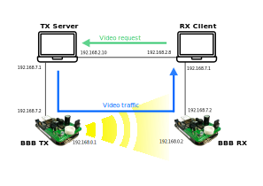

# Video demo

In this demo we show a video transmission over a VLC (Visible Light Communication) link. The
testbed is based on a different link for each direction: an Ethernet link and a visible light link. 
The VLC link uses 2 BBB acting as routers to redirect the traffic from the TX
laptop (server) to the RX laptop (client). Communication in the other way is carry out through
an Ethernet link.

Both computers are running Linux and the BBB run the OpenVLC1.3 driver with the
OpenVLC1.3 Rev A capes, plugged using USB interfaces.
The video is hosted in a HTTP server. The client asks for the video (using VLC application)
through the ethernet connection (tested wired connection, WiFi to be tested), and the server
sends it through the VLC link. Due to the TCP transmission, when a packet is lost, the client
asks for it through the ethernet connection.

## Configuration

To carry out this demo we only need to configure the networks involved so the routing can be done correctly.
There are 4 networks in the system, described in next image:

## Video transmission

An easy an reliable way of transmitting video in this setup is using VLC media player 
(https://www.videolan.org/vlc/index.en.html). Use the following command to install 
it in both computers "TX Server" and "RX Client":

``
sudo snap install vlc
``

After a successful install, we will use HTTP to stream video from one computer to another. Run in "TX Server":

``
vlc -vvv video_test_720.mp4 --sout '#standard{access=http,dst=192.168.2.8:8080}'
``

And in "RX Client":

``
vlc http://192.168.2.8:8080
``

Further details on this demo can be found in the following publication: 
Ander Galisteo, Diego Juara, Hector Cordobes, and Domenico Giustiniano. 2019. _Video Transmission Using Low-Cost Visible Light Communication_. In <i>Proceedings of the Twentieth ACM International Symposium on Mobile Ad Hoc Networking and Computing</i> (<i>Mobihoc '19</i>). Association for Computing Machinery, New York, NY, USA, 401–402. DOI: https://doi.org/10.1145/3323679.3326617

